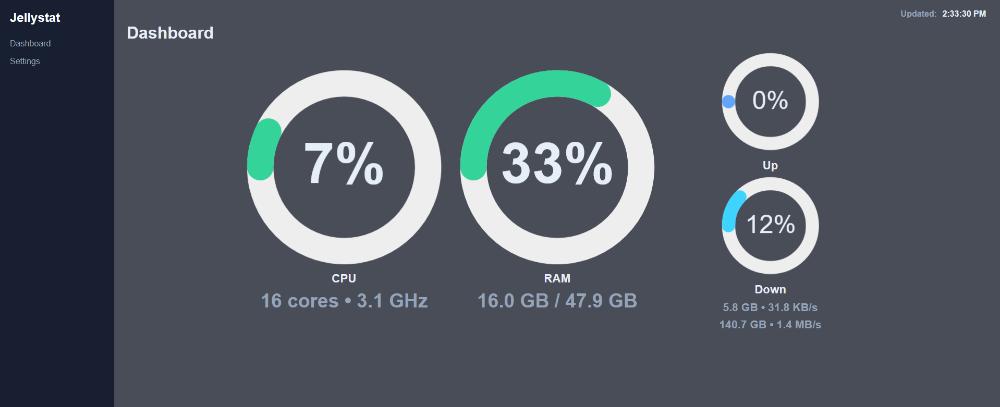
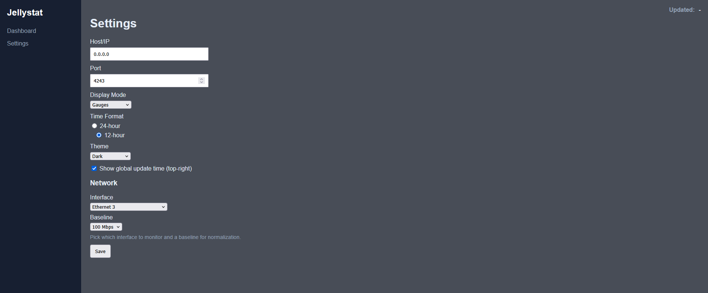

# Jellystat Simple Server

This is a minimal Flask app that starts a web server and displays "Hello world" on the Dashboard. It also includes a left sidebar with Dashboard and Settings.

Features:
- Dashboard: shows "Hello world"
- Settings: set host/IP and port and save to `config.json`

Run (Windows PowerShell):

```powershell
python -m venv .venv; .\.venv\Scripts\Activate.ps1; pip install -r requirements.txt
python app.py
```

Default port is 4242 and default host is 0.0.0.0. Settings are stored in `config.json` next to `app.py` after you save them.

## Screenshots

Dashboard view:



Settings view:


